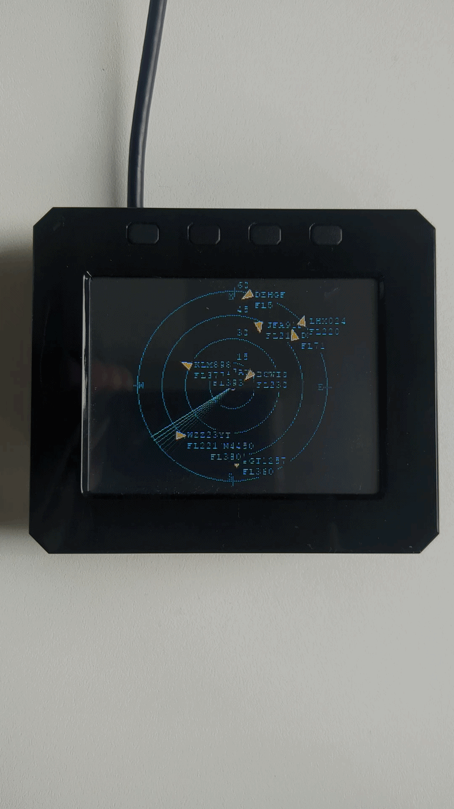
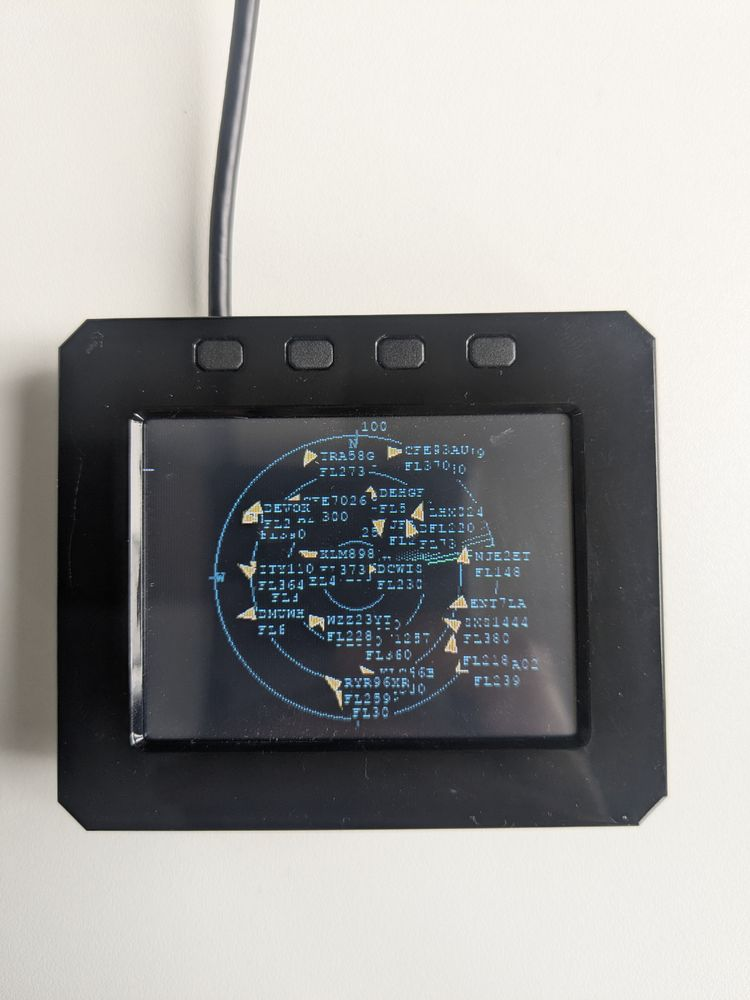
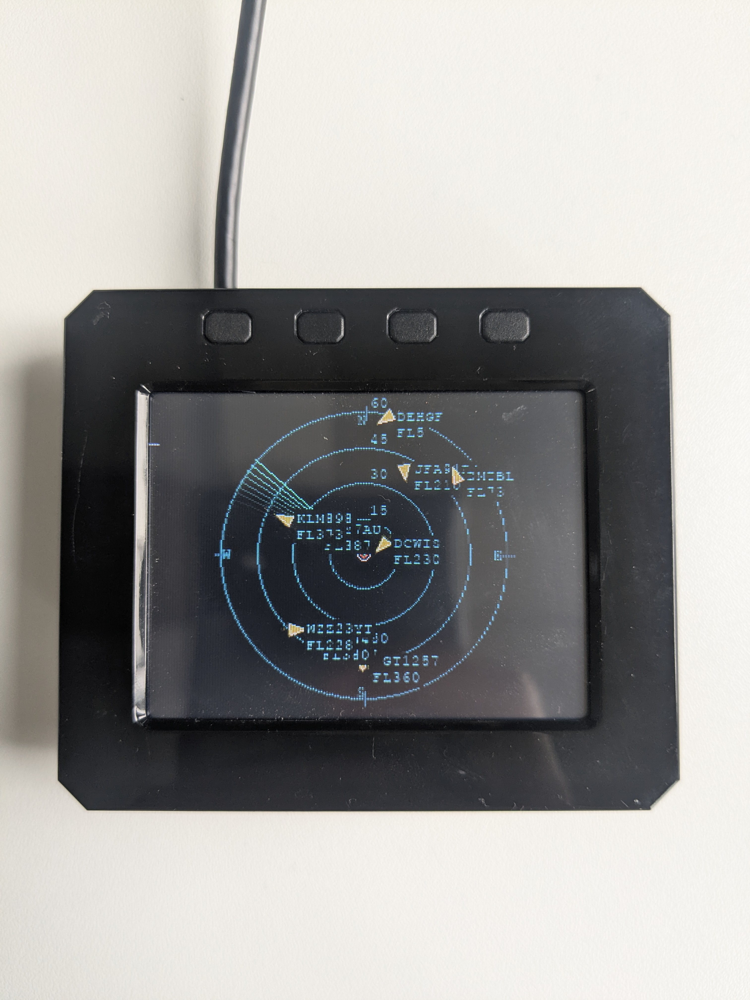
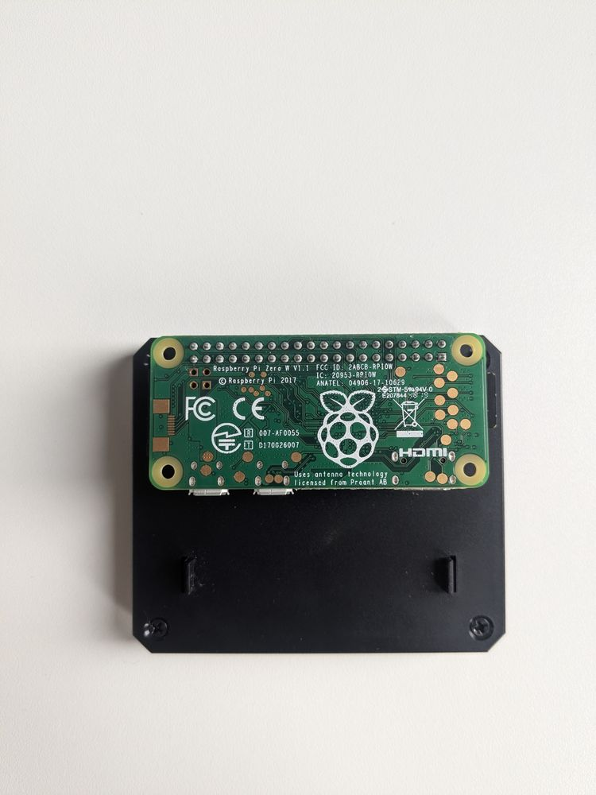
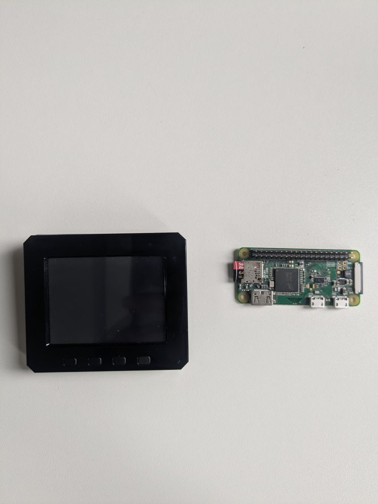

# Live Flight Tracker (Raspberry Pi Zero W)

A radar-scope style display of live aircraft overhead, pulled from the free
**OpenSky Network** API over WiFi, rendered directly to a small SPI display —
no desktop environment, no map tiles, no SDR hardware needed. Just the Pi and
a display.

## Gallery



| | |
|---|---|
|  |  |
|  |  |

## How it works

1. `src/flight_tracker/opensky_client.py` authenticates with OpenSky Network's
   OAuth2 client-credentials flow and polls `/api/states/all` for a bounding
   box around your location, getting back live aircraft position reports.
2. The app computes each aircraft's distance/bearing from your location and
   draws a radar screen (range rings, N-up, a sweeping scan line, rotated
   plane icons with callsign + altitude) onto an off-screen `pygame` surface.
3. Because the display is a legacy SPI framebuffer (`/dev/fb1`) rather than a
   DRM/KMS device — and modern SDL2 dropped support for that — the renderer
   writes the surface's raw RGB565 bytes straight to the framebuffer device
   itself instead of going through `pygame.display`.

## Hardware

- Raspberry Pi Zero W (v1.1)
- [Argon POD 2.8" display](https://argon40.com/products/pod-display-2-8inch) —
  SPI touchscreen (ILI9341-class panel, XPT2046-style touch controller, 4
  buttons), full 40-pin GPIO header
- WiFi (built-in)

## Setup

### 1. Base OS setup

On the Pi:

```bash
git clone <this repo> ~/live_flight_tracker
cd ~/live_flight_tracker
bash scripts/setup_pi.sh
```

Installs Python/venv tooling and enables SPI.

### 2. Display driver (Argon POD)

Argon40 ships an official installer for this display:

```bash
curl -fsSL https://download.argon40.com/podsystem.sh -o /tmp/podsystem.sh
bash /tmp/podsystem.sh
```

Known issue: on Raspberry Pi OS Bookworm/Trixie (which moved boot files to
`/boot/firmware/`), this script has two bugs worth checking for afterwards:

- It hardcodes the overlay file path to `/boot/overlays/` instead of
  `/boot/firmware/overlays/` — the display driver silently won't load unless
  you copy `tft9341.dtbo` / `tft9341-overlay.dtb` there yourself.
- It has a `grep ... $tmpfile > $tmpfile` bug (same file as input and output)
  that can blank the temp file used to rewrite `config.txt`, potentially
  wiping your original boot config down to just the display's own settings.
  It does back up the original to `/etc/argonpod/system_backup/config.txt`
  first — if this happens, merge that backup with the new display block
  rather than losing your original settings.

After a reboot, `/dev/fb1` (320x240, 16bpp RGB565) should exist alongside
`/dev/fb0` (HDMI).

### 3. Python environment

The pinned `pygame` version doesn't have a prebuilt wheel for this Pi's
Python/arch combo and fails to compile from source (a Python 3.13 vs.
pygame's MIDI bindings incompatibility). Use the apt-packaged pygame instead
of building it:

```bash
sudo apt-get install -y python3-pygame python3-libgpiod
python3 -m venv --system-site-packages .venv
.venv/bin/pip install requests==2.32.3 PyYAML==6.0.2
```

(`python3-libgpiod` is used by `buttons.py` for the Argon POD's 4 physical
buttons - it's usually already installed as a side effect of step 2's Argon
setup, but the explicit install above is harmless if so.)

### 4. OpenSky credentials

Anonymous OpenSky access is capped around 400 requests/day. Register a free
account at https://opensky-network.org/, create an API client under your
account (Account → API Client), and put the resulting `clientId`/
`clientSecret` in a `.env` file — **not** in `config.yaml`, since this repo
is public:

```bash
cat > ~/live_flight_tracker/.env << 'EOF'
OPENSKY_CLIENT_ID=your-client-id
OPENSKY_CLIENT_SECRET=your-client-secret
EOF
chmod 600 ~/live_flight_tracker/.env
```

With registered access (~4000 requests/day) you can poll roughly every 25-30s.

### 5. Location

Edit `config.yaml` → `home.lat` / `home.lon` to your coordinates (this is the
center of the radar and how distance/bearing to aircraft are computed).

## Controls

The Argon POD's 4 buttons (read directly via GPIO, not Argon's own daemon -
see `buttons.py`):

| Button | Action |
|---|---|
| A | Zoom in (smaller range) |
| B | Zoom out (larger range) |
| C | Force an immediate data refresh |
| D | Switch aircraft labels between basic (callsign/altitude) and metadata (aircraft type/route) |

## Running

Manually, for testing:

```bash
set -a && source .env && set +a
.venv/bin/python -m src.flight_tracker.main config.yaml
```

As a boot-time service:

```bash
sudo cp systemd/flight-tracker.service /etc/systemd/system/
sudo systemctl daemon-reload
sudo systemctl enable --now flight-tracker.service
sudo journalctl -u flight-tracker.service -f   # logs

# The console (tty1) maps to the same framebuffer as the display and will
# fight the app for it on every boot unless disabled:
sudo systemctl disable getty@tty1.service
```

## Troubleshooting

- **No aircraft ever show up**: test the API directly first — an empty
  `states` list from `/api/states/all` can mean genuinely no traffic overhead
  right now, or coverage gaps in your area.
- **429 / rate limited errors**: you're polling too often — raise
  `poll_interval_s` in `config.yaml`, or confirm your `.env` credentials are
  actually being picked up (registered access has a much higher cap).
- **Screen stays blank**: confirm `/dev/fb1` (or whatever `display.fbdev`
  points to) exists (`ls /dev/fb*`) — if not, the display driver overlay
  isn't loaded (see step 2 above).
- **Two overlapping/flickering renders**: only one instance of the app should
  write to the framebuffer at a time — check for and kill duplicates with
  `pgrep -af flight_tracker.main`.
- **Performance**: keep `display.fps` low (1-2) — the Zero W's CPU is the
  bottleneck, and aircraft positions only update as often as
  `poll_interval_s` allows anyway.
